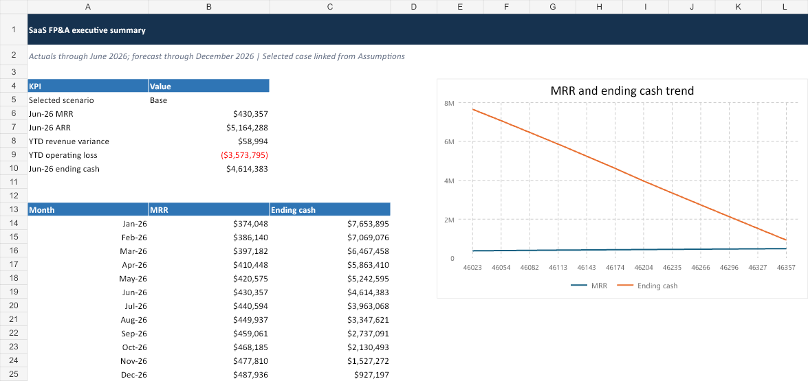

# SaaS FP&A Control Tower

SaaS financial planning, forecasting, unit economics, and liquidity-risk case study.

## Executive overview

Developed a 48-month driver-based FP&A model for a fictional B2B SaaS company covering January 2023 through December 2026. Historical actuals run through June 2026; July through December 2026 is a rolling forecast.

The model answers the questions an FP&A team should be able to answer every month:

- Is recurring revenue growing for the right reasons?
- Are retention, pricing, acquisition cost, and lifetime value improving?
- Where is actual performance diverging from budget or forecast?
- How do hiring and cost drivers affect cash runway?
- What is the probability that the company needs funding before year-end?

All company names, customers, employees, and financial values are synthetic and intended for case-study demonstration only.

## Executive dashboard preview

The workbook opens with an executive view linking recurring revenue, budget performance, operating loss, and cash runway.

The full model, scenario controls, supporting schedules, audit checks, and management outputs are available in the [`deliverables`](deliverables/) folder.

## Management interpretation

The analysis indicates recurring-revenue growth accompanied by material cash consumption. June MRR is **$430K** and ARR is **$5.16M**, while year-to-date revenue is **$59K above budget**. GRR and NRR are both **98.4%**, indicating modest contraction within the existing customer base after churn and expansion. New-customer acquisition remains the primary contributor to topline growth.

The unit economics are attractive at **5.7x LTV/CAC**, but the operating model still produces a **$3.57M YTD loss**. Base-case cash falls from **$4.61M in June to $0.93M in December**, and the Monte Carlo view estimates a **59.7% probability of ending below $1M**. The practical management question is therefore funding timing and cash-buffer discipline, not whether the business can produce revenue.

Recommended management actions are to identify the segments driving sub-100% NRR, link hiring decisions to capacity or quota coverage, separate cloud usage growth from unit-cost inflation, and establish a cash threshold that triggers financing activity. See [`analysis/management_insights.md`](analysis/management_insights.md) for the detailed interpretation and model guardrails.

## Key modeled outputs

| Area | Outputs |
|---|---|
| Revenue | MRR, ARR, customer bridge, plan mix, ARPC, ARR waterfall |
| SaaS economics | GRR, NRR, CAC, LTV, LTV/CAC, cohort retention |
| Planning | Budget vs actuals, rolling forecast, scenario drivers, sensitivity analysis |
| Cost and people | Payroll, benefits, fixed/variable opex, planned vs actual headcount |
| Accounting | Recognized revenue, billings, collections, deferred revenue, A/R proxy |
| Cash and risk | Cash bridge, burn, runway, forecast back-test, Monte Carlo liquidity risk |
| Reporting | Executive dashboard, management deck, validated variance commentary |

## Deliverables

- `deliverables/SaaS_FP&A_Model.xlsx`: linked financial model, scenario controls, sensitivities, checks, and dashboard-ready tables
- `deliverables/SaaS_FP&A_Model_Masters.xlsx`: extended model with SaaS unit economics, ARR bridge, cohorts, integrated statements, forecast QA, and Monte Carlo liquidity risk
- `deliverables/SaaS_FP&A_Management_Deck.pptx`: management presentation
- `deliverables/SaaS_FP&A_Management_Deck_Masters.pptx`: expanded management deck with cohort, unit-economics, and stochastic-risk analysis
- `deliverables/Variance_Commentary_Report.docx`: AI-assisted draft commentary with a manual validation record
- `data/saas_fpa.db`: SQLite analytical database
- `data/*.csv`: Power BI-ready fact and dimension extracts
- `sql/analysis_queries.sql`: management reporting queries
- `powerbi/`: star schema, DAX measures, and page build guide

## Refresh

1. Run `python build/generate_data.py`.
2. Run the workbook and presentation builders in `build/`.
3. Load the CSV files or SQLite tables into Power BI and apply the supplied relationships and measures.

All company names and values are synthetic and intended for case-study demonstration only.
